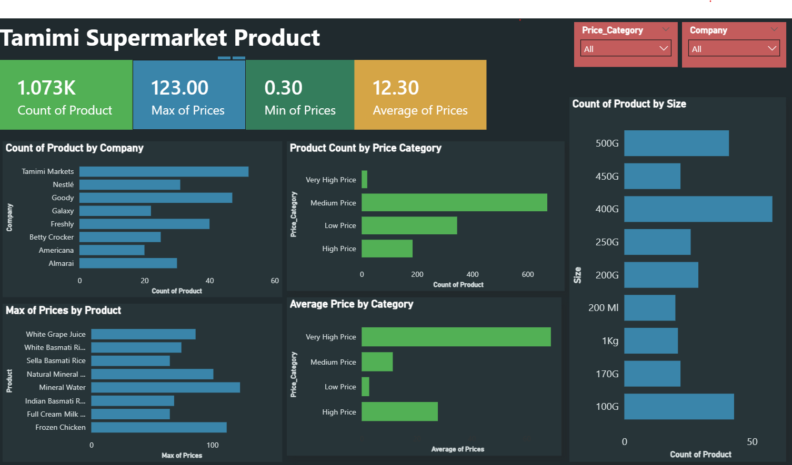

# Tamimi Supermarket Product Analysis

## Project Overview

This project analyzes product pricing data from Tamimi supermarket in Saudi Arabia.
The goal is to understand pricing patterns, product variety, company distribution, price categories, and product size trends.

The analysis was performed using Python for data cleaning and exploratory data analysis, and Power BI was used to build an interactive dashboard.

---

## Tools Used

* Python
* Pandas
* Matplotlib
* Power BI
* GitHub

---

## Dataset

The dataset contains product information from Tamimi supermarket in Saudi Arabia.

Main columns:

* Company
* Product
* Size
* Currency
* Prices
* Price_Category

The cleaned dataset contains product prices in Saudi Riyal (SAR).

---

## Key Insights

* The dataset contains 1,220 product records.
* The average product price is approximately 12.30 SAR.
* The highest product price is 123 SAR.
* The lowest product price is 0.30 SAR.
* Most products fall under the medium-price category.
* Tamimi Markets has the highest number of products.
* Larger package sizes and multi-pack items usually have higher prices.
* Very high-priced products represent only a small portion of the dataset.

---

## Dashboard Preview



---

## Project Structure

```text
```text
Tamimi-Supermarket-Analysis/
│
├── data/
│   ├── clean_tamimi_data.csv
│   └── tamimimarkets.csv
│
├── notebook/
│   └── tamimi_analysis.ipynb
│
├── dashboard/
│   └── Tamimi_Supermarket_Dashboard.pbix
│
├── images/
│   └── dashboard_screenshot.png
│
└── README.md
```
```

---

## Power BI Dashboard

The dashboard includes:

* Product count
* Maximum price
* Minimum price
* Average price
* Product count by company
* Product count by price category
* Average price by price category
* Top products by maximum price
* Product count by size
* Interactive filters by company and price category

---

## Conclusion

This project provides a clear overview of product pricing patterns in Tamimi supermarket.
The dashboard helps users explore product distribution by company, price category, product size, and maximum product prices.
